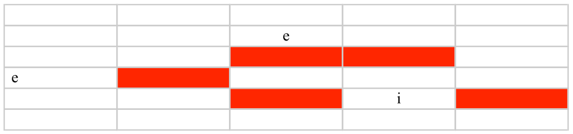

# Tarea: Resolución de problemas mediante búsquedas

- **Asignatura:** Modelos de Inteligencia Artificial
- **Tema:** Búsqueda en espacios de estados (Ejercicios 6.45 - 6.50)

---

## Ejercicio 1: El NPC en la cuadrícula

### Planteamiento y Formalización
El objetivo es encontrar la ruta óptima para un NPC desde una posición inicial **(i)** hasta una meta **(e)** en un tablero con obstáculos.



* **Estado inicial $(i)$:** $(3,4)$
* **Estado objetivo $(e)$:** $(2,1)$
    * *Nota:* Se selecciona $(2,1)$ como meta porque su distancia Manhattan es $h=4$ $(|3-2| + |4-1| = 4)$, coincidiendo con los datos del problema.
* **Operadores (Acciones):** Arriba, Abajo, Izquierda, Derecha.
* **Costes:**
    * Movimiento Vertical = **1**
    * Movimiento Horizontal = **2**
* **Restricción:** No se puede pasar por casillas sombreadas (Muros).

---

### 1. Búsqueda en Anchura (BFS)
Estrategia: FIFO (First In, First Out). Explora por niveles de profundidad.

**Traza de ejecución:**
1.  **Inicio en (3,4)**. Se expanden los vecinos.
2.  El algoritmo sube a **(3,3)**.
3.  Intenta subir a **(3,2)** pero encuentra un **obstáculo**.
4.  Al estar bloqueado arriba y a la izquierda, explora la rama derecha hacia **(4,3)**.
5.  Desde ahí encuentra camino libre hacia arriba: **(4,2) → (4,1)**.
6.  En la fila 1, se mueve a la izquierda: **(3,1) → (2,1)**.

**Camino Solución:**
`(3,4) → (3,3) → (4,3) → (4,2) → (4,1) → (3,1) → (2,1)`

---

### 2. Búsqueda en Profundidad (DFS)
Estrategia: LIFO (Last In, First Out). Profundiza tanto como sea posible antes de retroceder.

**Análisis con límite de profundidad = 5**
* Traza intentada: `(3,4) → (3,3) → (4,3) → (4,2) → (4,1) → (3,1)`.
* En el nodo **(3,1)** se han consumido 5 pasos.
* La meta está en **(2,1)**, que requeriría un 6º paso.
* **Resultado:** **FRACASO (Corte por límite)**. El algoritmo se detiene justo antes de la meta.

**Análisis con límite de profundidad = 6**
* Al permitir un paso más, el algoritmo alcanza el nodo **(2,1)**.
* **Resultado:** **ÉXITO**.

---

### 3. Búsqueda de Coste Uniforme (UCS)
Estrategia: Expandir el nodo con menor coste acumulado $g(n)$.

**Cálculo del Coste Total de la ruta:**
La ruta encontrada implica rodear el obstáculo central.
* 3 movimientos Verticales (coste 1 c/u) = $3 \times 1 = 3$
* 3 movimientos Horizontales (coste 2 c/u) = $3 \times 2 = 6$
* **Coste Total:** $3 + 6 = \mathbf{9}$

---

### 4. Algoritmo A*
Estrategia: Expandir el nodo con menor valor de evaluación $f(n) = g(n) + h(n)$.
* **Heurística $h(n)$:** Distancia Manhattan (suma de diferencias de coordenadas).

**Traza detallada del Árbol de Búsqueda:**

1.  **NODO (3,4):**
    * $g=0$ (coste inicial)
    * $h=4$ (distancia a meta)
    * **$f = 4$**

2.  **Expansión (3,4) → (3,3):**
    * $g=1$ (1 paso vertical)
    * $h=3$
    * **$f = 4$**
    * *Decisión:* Es el nodo más prometedor.

3.  **Intento de Expansión (3,3) → Arriba (3,2):**
    * **¡MURO!** El camino óptimo teórico está bloqueado.
    * El algoritmo debe buscar la siguiente mejor opción en la frontera (OPEN list).

4.  **Expansión Alternativa (3,3) → Derecha (4,3):**
    * $g=3$ (1 vertical + 1 horizontal de coste 2)
    * $h=4$ (distancia a meta)
    * **$f = 7$**
    * *Nota:* Aunque el coste $f$ sube a 7, es la única ruta viable.

5.  **Camino hacia la meta:**
    * **(4,2):** $g=4, h=3 \rightarrow \mathbf{f=7}$
    * **(4,1):** $g=5, h=2 \rightarrow \mathbf{f=7}$
    * **(3,1):** $g=7, h=1 \rightarrow \mathbf{f=8}$ (Coste sube por mov. horizontal)
    * **(2,1):** $g=9, h=0 \rightarrow \mathbf{f=9}$ (META)

``` 
INICIO (3,4)  [f=4]
  |
  +--- OPCIÓN A: Arriba -> (3,3)
  |      |
  |      +--- Intentar Arriba -> (3,2)
  |             |
  |             X  << BLOQUEADO POR MURO >>
  |             (El coste sube a infinito, rama muerta)
  |
  +--- OPCIÓN B: Derecha -> (4,3)  [f=7]
         |
         V
       (4,2)  [Subimos...]
         |
         V
       (4,1)  [Subimos...]
         |
         V
       (3,1)  [Izquierda...]
         |
         V
    ★ META (2,1) ★
```
---

## Ejercicio 2: Análisis de la Heurística

**Pregunta:** ¿Es admisible la heurística Manhattan en este problema?

**Respuesta:** **SÍ, es admisible.**

**Justificación Teórica:**
Una heurística $h(n)$ es admisible si nunca sobreestima el coste real para alcanzar la meta ($h^*(n)$).
$$h(n) \le h^*(n)$$

**Aplicación al problema:**
1.  **Nuestra Heurística:** Asume que moverse una casilla siempre cuesta **1**.
2.  **La Realidad:** Moverse una casilla cuesta **1** (vertical) o **2** (horizontal).
3.  **Comparación:**
    * En vertical: Estimado (1) = Real (1).
    * En horizontal: Estimado (1) < Real (2).

**Conclusión:** La heurística siempre es "optimista" (menor o igual al coste real), por lo tanto es admisible y garantiza que A* encuentre la solución óptima.

---

## Ejercicio 3: Ruta Ourense - Calatayud

**Enunciado:** Calcular la ruta más corta en km utilizando el algoritmo de **Búsqueda de Coste Uniforme**.

### Traza de Ejecución (Paso a Paso)
El algoritmo mantiene una frontera de nodos ordenados por coste acumulado creciente.

1.  **Inicio:** `[(0, Ourense)]`
2.  **Expande Ourense:**
    * Hijos: Ponferrada (175), Benavente (236).
    * Frontera: `[Ponferrada(175), Benavente(236)]`
3.  **Expande Ponferrada (175):**
    * Hijos: León (175+113=288), Benavente (175+125=300).
    * *Nota:* El camino a Benavente por Ponferrada (300) es peor que el directo (236), se descarta.
    * Frontera: `[Benavente(236), León(288)]`
4.  **Expande Benavente (236):**
    * Hijos: León (311 -> descartado), Palencia (348), Valladolid (348).
    * Frontera ordenada: `[León(288), Palencia(348), Valladolid(348)]`
5.  **Expande León (288):**
    * Hijos: Osorno (288+121=409).
    * Frontera: `[Palencia(348), Valladolid(348), Osorno(409)]`
6.  **Expande Palencia (348):**
    * Hijos: Osorno (348+49=397) -> **¡Mejora!** Actualizamos Osorno de 409 a 397.
    * Hijos: Burgos (348+92=440).
    * Frontera: `[Valladolid(348), Osorno(397), Burgos(440)]`
7.  **Expande Valladolid (348):**
    * Hijos: Aranda (348+95=443).
    * Frontera: `[Osorno(397), Burgos(440), Aranda(443)]`
8.  **Expande Osorno (397):**
    * Hijos: Burgos (397+59=456) -> Descartado (440 es mejor).
    * Frontera: `[Burgos(440), Aranda(443)]`
9.  **Expande Burgos (440):**
    * Hijos: Soria (583), Logroño (590).
    * Frontera: `[Aranda(443), Soria(583), Logroño(590)]`
10. **Expande Aranda (443):**
    * Hijos: Osma (443+58=501).
    * Frontera: `[Osma(501), Soria(583), Logroño(590)]`
11. **Expande Osma (501):**
    * Hijos: **Calatayud (501+140=641)** -> ¡Meta vista! Pero se añade a la frontera.
    * Hijos: Soria (501+58=559) -> **¡Mejora!** Actualizamos Soria de 583 a 559.
    * Frontera ordenada: `[Soria(559), Logroño(590), Calatayud(641)]`
    * *Importante:* Aunque tenemos un camino a la meta (641), debemos expandir Soria (559) por si hubiese un atajo "milagroso" muy corto desde allí.
12. **Expande Soria (559):**
    * Hijos: Calatayud (559+91=650).
    * Como 650 > 641, este camino no sirve.
    * Frontera: `[Logroño(590), Calatayud(641)]`
13. **Expande Logroño (590):** No mejora nada.
14. **Expande Calatayud (641):** Es el menor coste de la frontera y es la meta. **FIN**.

```
[g=0] OURENSE
  |
  +---> [g=175] PONFERRADA
  |       |
  |       +---> [g=288] León
  |       |
  |       +---> [g=300] Benavente  (X) SE DESCARTA
  |                                (Ya existe un camino a Benavente con g=236)
  |
  +---> [g=236] BENAVENTE  << MEJOR CAMINO >>
          |
          +---> [g=348] VALLADOLID
          |       |
          |       +---> [g=443] ARANDA
          |               |
          |               +---> [g=501] OSMA
          |                       |
          |                       +---> [g=559] Soria
          |                       |       |
          |                       |       +---> [g=650] Calatayud (X) 
          |                       |
          |                       +---> [g=641] ★ CALATAYUD (META) ★
          |
          +---> [g=348] Palencia
                  |
                  +---> [g=397] Osorno
                          |
                          +---> [g=456] Burgos (X)
```

### Solución Final

* **Ruta Óptima:**
    `Ourense → Benavente → Valladolid → Aranda → Osma → Calatayud`

* **Distancia Total:**
    **641 km**
